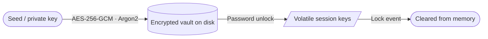
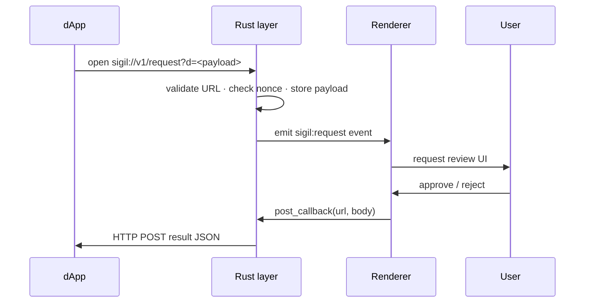

<div align="center">


# Sigil

**Self-custodial Qubic desktop wallet**

[](https://github.com/sigil-oss/sigil.app/releases/latest)
[](https://github.com/sigil-oss/sigil.app/actions)
[](./LICENSE)
[](https://discord.gg/s5qNRNGu96)

Windows · macOS (Universal) · Linux (AppImage · .deb · .rpm)

[**Download**](https://github.com/sigil-oss/sigil.app/releases/latest) · [Website](https://sigil.app) · [Discord](https://discord.gg/s5qNRNGu96)

</div>

---

Keys stay encrypted on disk. Signing material lives only in Rust process memory and is wiped immediately on lock. No Sigil backend, no key escrow, no browser extension surface.

## Features

**Wallet**
- Send, receive, burn, stake
- Send Many — up to 25 transfers in a single session with CSV/JSON import
- Full transaction history with memos and fiat price snapshots
- Vault analytics — net flow, top counterparties, monthly summaries
- Global search across accounts, contacts, tx hashes, and memos

**Security**
- AES-256-GCM encrypted vaults with Argon2 KDF
- Auto-lock on idle, sleep, or window blur
- Clipboard auto-clear; immediate wipe on lock
- Biometric unlock — Windows Hello, macOS Touch ID, Linux secret store
- Local audit log of every signing event
- Signed update payload verification

**dApp integration**
- Native `sigil://` deep-link protocol
- Request types: `transfer`, `sc_call`, `sign_message`, `verify_message`, `connect`
- Replay protection via nonce store (1-hour window)
- Result delivery via server callback POST or browser redirect
- Request history with per-entry callback status

**Desktop**
- System tray with hide-to-tray
- Desktop notifications with inbox, per-type filters, and price/balance alerts
- Multiple vaults with color coding, watch-only support
- Themes, font pairs, accent colors

## Security Model

Vault data is encrypted before hitting disk. Unlocked keys never leave the Rust process.



Sensitive operations are isolated to the Rust layer — the renderer only sends signing requests and receives back signed transactions.

| Operation | Layer |
|---|---|
| Vault encryption / decryption | Rust (`aes-gcm`) |
| Deep-link URL validation | Rust |
| Nonce replay protection | Rust |
| Callback HTTP posting | Rust (`reqwest`) |
| Auto-lock timer | Rust (background thread) |
| Clipboard clear | Rust |
| Update payload verification | Rust |

## Deep-Link Protocol

dApps send requests by opening a `sigil://v1/request?d=<base64url-envelope>` URL. Sigil validates, queues, and presents a review screen. Results are delivered to the dApp via callback POST or redirect URL.



Use [`@sigil-oss/connect`](https://github.com/sigil-oss/sigil.connect) to build envelopes and handle result delivery from any framework.

## Build Locally

**Requirements:** [Rust stable](https://rustup.rs/) · [Bun](https://bun.sh/) · [Tauri v2 prerequisites](https://v2.tauri.app/start/prerequisites/)

```sh
git clone https://github.com/sigil-oss/sigil.app
cd sigil.app
bun install
bun tauri dev        # dev server
bun tauri build      # production bundle → src-tauri/target/release/bundle/
```

**Checks:**
```sh
bun run typecheck
bun run test
cargo check --manifest-path src-tauri/Cargo.toml
```

## Stack

| Layer | Choice |
|---|---|
| Desktop shell | Tauri v2 |
| Frontend | React 19 + TypeScript |
| State | Zustand v5 + TanStack Query v5 |
| Animations | Motion |
| Native | Rust |
| Crypto | `aes-gcm` (Rust) |
| Qubic SDK | `@qubic-lib/{crypto,tx,rpc,contracts}` |

## Updater

| Platform | Update path |
|---|---|
| Windows | NSIS built-in updater |
| macOS | App built-in updater |
| Linux AppImage | Built-in updater |
| Linux deb / rpm | System package manager |

## Community

- **Discord:** https://discord.gg/s5qNRNGu96
- **GitHub:** https://github.com/sigil-oss/sigil.app
- **Website:** https://sigil.app

## License

Source-available. See repository for current terms.
